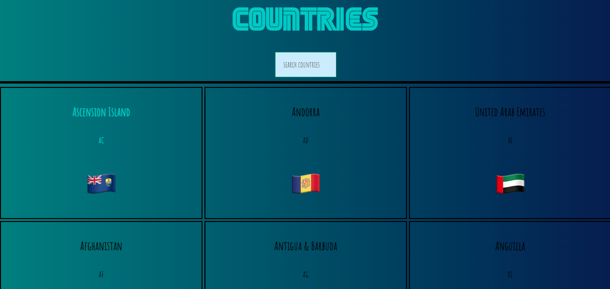

# Country App
A fully responsive web site created using React front end. You can look up and find countries by searching it name in search-field. Result will match while you are typing life and will give you final country with name and flag. After I finished my project I have decided to use Redux on this app. I implemented it on my SearchField component. 

### Technologies Used
- Node.js
- React
- Redux
- Javascript
- CSS
- Tachyons

